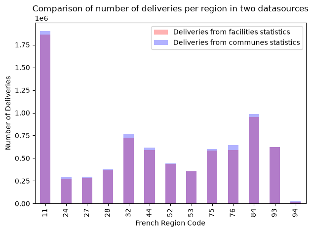

# Maternity Instances

Instances based on data of French maternity wards and communes-level labors statistics. Since the data used is public, several simplifying hypotheses are made.
Particularly, labor is represented as a unique activity abstracting the details of the different interventions. We detail below the hypotheses made.

### Data Sources
Several open data sources were used to construct  instances for our optimization problem.

-  Dataset of french maternity wards [^drees2025]. This dataset contains yearly (10 years) info on `deliveries_per_facility` and the number of `beds` per facility. 
The type of maternity ward is also recorded (type 1, 2a, 2b, or 3). 
- The french national directory of health establishements [^datagouv2025]. We use this dataset mainly to extract the coordinates of each maternity ward.
- Statistics on number of births by commune [^insee2025]. This dataset allows us to set the lower bounds $d_{gr}$ on our model's demand.
- Additional open data for precise coordinates of the regions, departments and communes in France.

The data sources have been synthesized in our project as two files 📄 [*summary_maternity_capacity.csv*](https://gitlab.emse.fr/cis-public/i4s/thierry-garaix/safepaw_strategic/-/raw/demo-refactor/data/open_data/summary_maternity_capacity.csv?ref_type=heads)  for the capacity 
in `beds` by facility and 📄 [*summary_maternity_labours.csv*](https://gitlab.emse.fr/cis-public/i4s/thierry-garaix/safepaw_strategic/-/raw/demo-refactor/data/open_data/summary_maternity_labours.csv?ref_type=heads) to extract the demand by commune. Sample rows are shown below.

|   year |   nofinesset | facility_name                  |   type |   region_code | region_name          |   dep_code | dep_name   |   comm_code | comm_name   | coords                                  |   deliveries_per_facility |   beds |
|-------:|-------------:|:-------------------------------|-------:|--------------:|:---------------------|-----------:|:-----------|------------:|:------------|:----------------------------------------|--------------------------:|-------:|
|   2020 |    010005239 | CH DU HAUT BUGEY - GEOVREISSET |      1 |            84 | Auvergne-Rhône-Alpes |         01 | Ain        |       01283 | OYONNAX     | (5.627347689975507, 46.275058914989415) |                       672 |     20 |

#### Verifying compatibility
We made sure that the two data sources were coherent by summing the number of deliveries by region across 10 years.

## Hypotheses

Some hypotheses are made to convert our datasets into our model parameters

### Demand per region {#sec:demand-per-region}

Using the values $L_{r,y}$ (deliveries in region $r$  year  $y$), we calcuate the fraction $d_{gr}$ as follows:

$
\bar{L}_r = \frac{1}{Y} \sum_{y=1}^{Y} L_{r,y} 
$

$
 d_{gr} = \frac{\bar{L}_r}{\sum_{r} \bar{L}_r}
$

This demand is global for all patient groups. As we do not have detailed info on the demand per pation group,
 we multiply the obtained global demands by the estimated statistics on delivery type  [^insee2025].

| Parameter                                  | Meaning                                                                            | Value                                                                                                                                                          |
|:-------------------------------------------|:-----------------------------------------------------------------------------------|:---------------------------------------------------------------------------------------------------------------------------------------------------------------|
| $G$                                        | Patients groups                                                                    | Four groups corresponding to maternity types [^1] (1,2a,2b,3)                                                                                                  |
| $K$                                        | Available pathways                                                                 | One pathway per group                                                                                                                                          |
| $R$                                        | Regions                                                                            | French communes                                                                                                                                                |
| $H$                                        | Facilities                                                                         | Facilities are the maternity wards                                                                                                                             |
| $L$                                        | Resources                                                                          | One resource (=bed/days) from *summary_maternity_capacity.csv*                                                                                                 |
| $U_g$                                      | Quality levels for group $g$                                                       | One quality level                                                                                                                                              |
| $A_{gk}$                                   | Number of activities for group $g$ pathway $k$                                     | One activity per pathway                                                                                                                                       |
| $I_{gu}$                                   | Pathways available for group $g$ quality level $u$                                 | Trivial as we have one unique pathway and quality level                                                                                                        |
| $O_{gk}$                                   | Facilities able to handle deliveries of type $g$                                   | Extracted from facility `type` in *summary_maternity_capacity.csv*                                                                                             |
| $J_h$                                      | Facilities transferable to from facility $h$                                       | All facilities of the same `type`                                                                                                                              |
| $N_{gka2}$                                 | Next activity                                                                      | Trivial as only one activity                                                                                                                                   |
| $N_{gka1}$                                 | All activities considered for potential transfer                                   | Trivial as only one activity                                                                                                                                   |
| $D$                                        | Total demand over service area                                                     | Total deliveries across the service area                                                                                                                       |
| $d_{gr}$                                   | Minimum deliveries of type $g$ in region $r$                                       | Calculated from *summary_maternity_labours.csv* (parameterizable)                                                                                              |
| $w_{rh}$                                   | Preference for patients from region $r$ to deliver in facility $h$                 | Affinities between regions (french departments) and maternity wards calculated as 1/distance (km) from the maternity ward to the center of the department [^2] |
| $\underline{q}_g$ / $\overline{q}_g$       | Minimum and maximum proportions of group $g$ to be treated                         | Not constrained                                                                                                                                                |
| $\underline{q}_{gu}$ / $\overline{q}_{gu}$ | Minimum and maximum proportions of group $g$ to be treated under quality $u$       | Not constrained                                                                                                                                                |
| $c_{gk}$                                   | Benefit score of assigning a patient from group $g$ with the care pathway $k$      | Trivial as only one pathway                                                                                                                                    |
| $m_{hl}$                                   | Total capacity of resource type l in healthcare facilities h                       | Number of `beds` per facility times 365 [^3]                                                                                                                   |
| $t_{gkal}$                                 | Consumption of resource $l=bed/days$ required to perform labour of group $g$       | Average length of stay for a delivery 4.6 [@DREES2021_naissance_accouchements]                                                                                 |
| $\delta_l$                                 | Transfer unit between healthcare facilities for each resource (bed/days)           | 365 [^4]                                                                                                                                                       |
| $b_{hl_{in}}$ $b_{hl_{out}}$               | Maximum proportions of resource type l transferable in and out of facility $h$     | 1 (parameterizable)                                                                                                                                            |
| $f$                                        | Maximum allowable percentage of patients who may be transferred between facilities | 1                                                                                                                                                              |
| $\alpha$                                   | Weight of objective function                                                       | 1 (parameterizable)                                     

|Delivery type | fraction|
|--------------|----------|
| 1 | 0.5 |
| 2a | 0.2 |
| 2b | 0.2|
| 3 | 0.1|

[^1]: Type 1: Obstetrics only; Type 2a: Obstetrics and neonatology; Type 2b: Obstetrics, neonatology, and neonatal intensive care; Type 3: Obstetrics, neonatology, neonatal intensive care, and neonatal resuscitation.
[^2]: For the department the maternity ward is situated in, this affinity score is set to 10 arbitrarity to reflect a high affinity. 
[^3]: The resource unit considered is bed/days per facility per year
[^4]: A resource transfer is considered definitive for the planning horizon

[^datagouv2025]: Ministère de la Santé. (2025). FINESS — Fichier National des Établissements Sanitaires et Sociaux (Open Data). https://www.data.gouv.fr/es/datasets/finess-extraction-du-fichier-des-etablissements/

[^drees2025]: Direction de la recherche, des études, de l'évaluation et des statistiques. (2025). Liste des maternités de France depuis 2000. https://www.data.gouv.fr/datasets/liste-des-maternites-de-france-depuis-2000

[^insee2025]: Institut national de la statistique et des études économiques. (2025). Nombre de naissances vivantes par commune en France. https://www.data.gouv.fr/fr/datasets/nombre-de-naissances-par-commune/

[^drees2021]: Direction de la recherche, des études, de l'évaluation et des statistiques. (2021). La naissance : Caractéristiques des accouchements. Ministère des Solidarités et de la Santé. https://drees.solidarites-sante.gouv.fr/sites/default/files/2021-07/Fiche%2024%20-%20La%20naissance%20-%20caract%C3%A9ristiques%20des%20accouchements.pdf