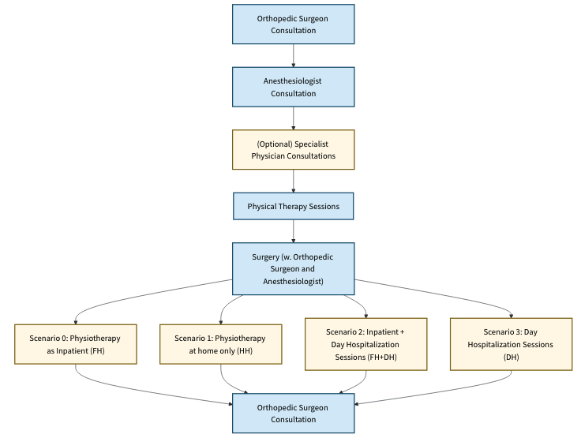

## Hip and Knee Arthopasty

This instance uses both public and private data to study the patient pathways for hip and knee replacements surgeries.
 We assume patients trajectories follow a general pathway illustrated below.

## Data Sources
The private datasets were extracted from PMSI and contain information on both medical facilities and visits statistics.
Specifically the three files available are:  

`types_parcours.csv`  summarizes patient care pathways.
| Field         | Description                                                                       |
|:--------------|:----------------------------------------------------------------------------------|
| BEN_RES_DPT   | French department code (of residence)                                             |
| sej_type      | Type of hospital stay (PTG= total knee arthoplasty / PTH=total hip arthoplasty)   |
| type_parcours | Care pathway type (specialists visits)                                            |
| SSR_TYPE      | Type of post-acute care (DOM=home care, HC=in-patient stay, HDJ=day care, HC+HDJ) |
| nb            | Number of visits recorded                                                         |

`ssr_2018r.csv` contains post-acute care activity information.

| Field   | Description                                                                                                        |
|:--------|:-------------------------------------------------------------------------------------------------------------------|
| FI_EJ   | Legal entity FINESS number                                                                                         |
| GDE     | SSR group/type (filter on adults=SSR_A visits)                                                                     |
| JOUHC   | Number of total hospitalization days of presences (used as a proxy to distribute `DAY_HC` resources to facilities) |
| JOUHP   | Number of partial hospitalization days of presence (used as a proxy to distribute `KINE_SSR` resources)            |

`mco_2018.csv` contains acute-care hospital activity information.

| Field     | Description                                                                                         |
|:----------|:----------------------------------------------------------------------------------------------------|
| FI_EJ     | Legal entity FINESS number                                                                          |
| JLI_CHI   | Capacity in bed-days (used as a proxy to distribute `standard` resources to facilities)             |
| ACTCLI_PM | Clinical activity indicator (used as a proxy to distribute `specialization`resources to facilities) |

## Hypotheses

Some hypotheses are made to convert our datasets into our model parameters

### Case-mix {#sec:casemix-per-region}
In this instance, patient groups $g$ are defined based on the type of arthoplasty (knee vs hip) and the medical specialists patients consult throughout their pathway. As such 
we calculate the case mix fractions $d_{gr}$ as the fraction of visits of that specific group $g$  (obtained from `types_parcours.csv`) times the fraction of of the population at risk in a canton. We defined
the population at risk as the population which is over 65 years of age.

### Optimization parameters details

| Parameter                                  | Meaning                                                                            | Value                                                                                                                                       |
|:-------------------------------------------|:-----------------------------------------------------------------------------------|:--------------------------------------------------------------------------------------------------------------------------------------------|
| $G$                                        | Patients groups                                                                    | Defined by arthoplasty type and specialists consulted                                                                                       |
| $K$                                        | Available pathways                                                                 | Rehabilitation options                                                                                                                      |
| $R$                                        | Regions                                                                            | French cantons                                                                                                                              |
| $H$                                        | Facilities                                                                         | MCO and SSR facilities and Home-stay                                                                                                        |
| $L$                                        | Resources                                                                          | Standard resources of the general pathway as well as specialists visited                                                                    |
| $U_g$                                      | Quality levels for group $g$                                                       | Quality levels can used to differentiate rehabilitation options                                                                             |
| $A_{gk}$                                   | Number of activities for group $g$ pathway $k$                                     | Set of general pathway activities along with specialists and rehabilitation activities                                                      |
| $I_{gu}$                                   | Pathways available for group $g$ quality level $u$                                 | Currently trivial as we have one unique pathway and quality level                                                                           |
| $O_{gk}$                                   | Facilities able to handle deliveries of type $g$                                   | Facility pathways are defined based on activity availability fields in MCO table (e.g dermatologist: PDER, rhumatologist: PRHU, etc..)      |
| $J_h$                                      | Facilities transferable to from facility $h$                                       | All facilities                                                                                                                              |
| $N_{gka2}$                                 | Next activity                                                                      | Transfers can occur for all activities save the last                                                                                        |
| $N_{gka1}$                                 | All activities considered for potential transfer                                   | Transfers only occur to the next activity in the predefined pathway                                                                         |
| $D$                                        | Total demand over service area                                                     | Total visits in the department of interest                                                                                                  |
| $d_{gr}$                                   | Minimum deliveries of type $g$ in region $r$                                       | Casemix calculated as per explanation above                                                                                                 |
| $w_{rh}$                                   | Preference for patients from region $r$ to deliver in facility $h$                 | Affinities between regions (french departments) and facilities calculated as 1/distance (km) from the facilitiy to the center of the canton |
| $\underline{q}_g$ / $\overline{q}_g$       | Minimum and maximum proportions of group $g$ to be treated                         | Not constrained by default                                                                                                                  |
| $\underline{q}_{gu}$ / $\overline{q}_{gu}$ | Minimum and maximum proportions of group $g$ to be treated under quality $u$       | Not constrained by default                                                                                                                  |
| $c_{gk}$                                   | Benefit score of assigning a patient from group $g$ with the care pathway $k$      |                                                                                                                                             |
| $m_{hl}$                                   | Total capacity of resource type l in healthcare facilities h                       | Total capacity needed (calculated as number of visits * activity consumption) distributed over facilities                                   |
| $t_{gkal}$                                 | Consumption of resource required to perform activity $a$ of group/pathway $g$/$k$  |                                                                                                                                             |
| $\delta_l$                                 | Transfer unit between healthcare facilities for each resource                      |                                                                                                                                             |
| $b_{hl_{in}}$ $b_{hl_{out}}$               | Maximum proportions of resource type l transferable in and out of facility $h$     |                                                                                                                                             |
| $f$                                        | Maximum allowable percentage of patients who may be transferred between facilities |                                                                                                                                             |
| $\alpha$                                   | Weight of objective function                                                       |                                                          